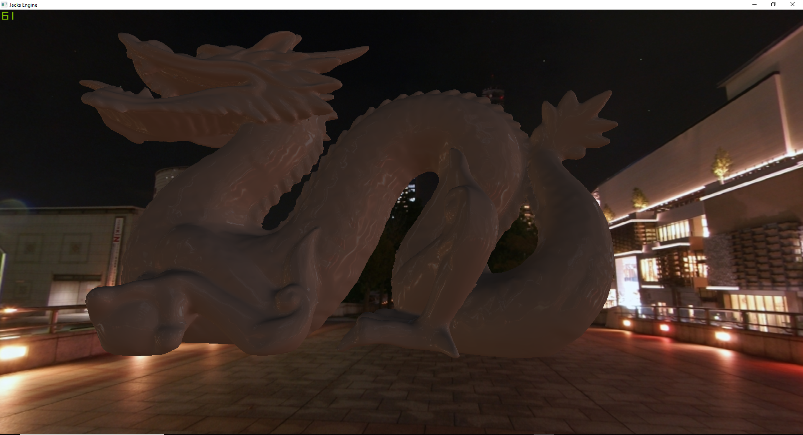
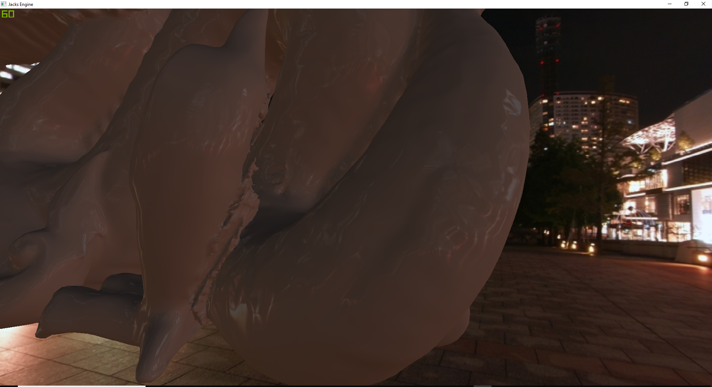

# C++-Engine

This engine is currently being developed to function primarily on Dx11 and Windows. However, there exists a wrapper over the Input and 
Application so that in the future other OSes can be supported. There is currently no wrapper around the Dx11 elements, and so the Engine
is tightly coupled to the API, but that is one of the future goals to fix.

The engine uses TinyXML to parse XML files that describe GameObjects and instantiate them in the scene. GameObjects follow a component
entity system, however currently no scripting for components is available.

DirectX shader reflection API is used to dynamically read shaders and setup all associated elements and buffers, as such a unique class
is not required per shader.

A skybox is supported, and there is a tool that reads the skybox cubemap and produces an Irradiance Map and its respective Spherical 
Harmonics, passing those into shaders for Ambient Lighting computations. The tool works by projecting the environment map on the spherical
harmonics. This works by taking the inner product of the environment map with 9 spherical harmonic basis functions, where the inner
product is an integral over the measure of solid angle.

Current shaders support Lambertian Diffuse and Specular. The specular component for now is only with the Skybox, as the scene does not have
any directional lighting. The specular component is used to determine which Mip level of the skybox cubemap to sample, such that more
rough materials sample a lower Mip and result in blurrier reflections.

The constant buffers in the shaders are layed out in a way that is performant, with a per application/per frame/per draw and $globals 
cbuffers each with a different frequency of updating based on their data.

